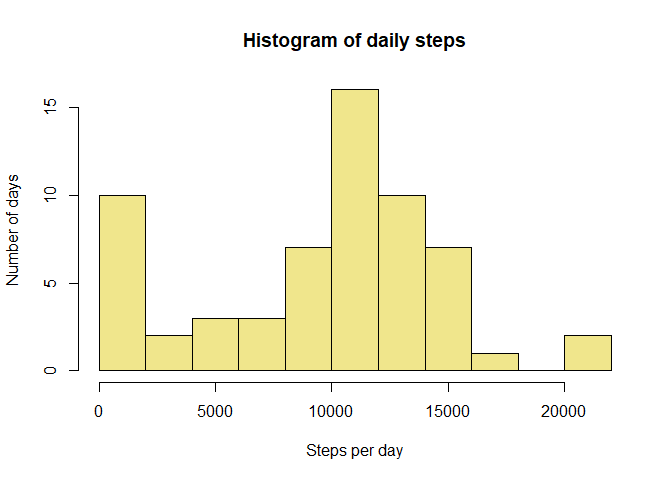
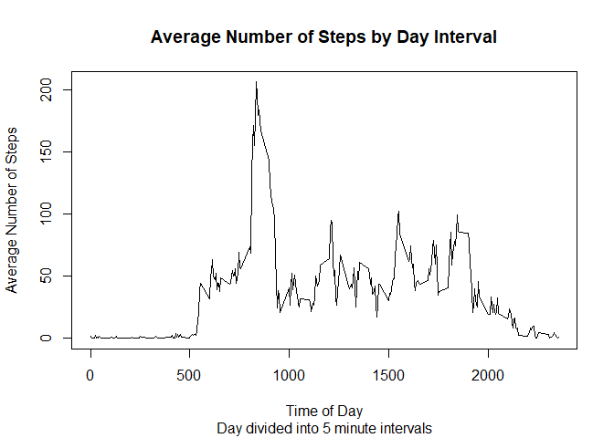
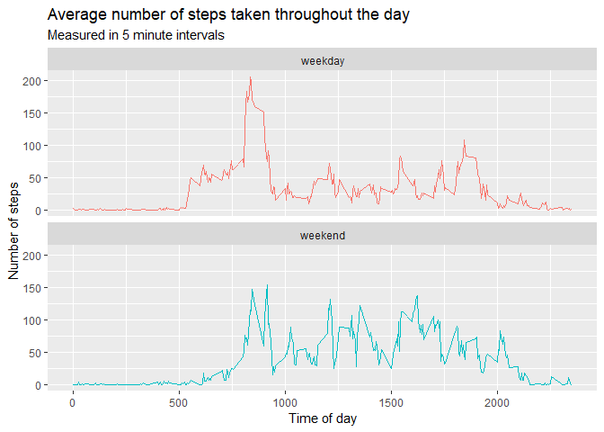

## Coursera - Reproducible Research Assignment 1

This analysis focuses on data from a personal activity monitoring device which collected data at 5 minute intervals through out the day. The data consists of two months of data from an anonymous individual during the months of October and November, 2012 and include the number of steps taken in 5 minute intervals each day.  This assignment will conduct basic exploratory analysis on the number of steps the individual took throughout the course of the two months.

## Loading and preprocessing the data


```r
# we make use of dplyr later on.
library(dplyr)
```

```
## 
## Attaching package: 'dplyr'
```

```
## The following objects are masked from 'package:stats':
## 
##     filter, lag
```

```
## The following objects are masked from 'package:base':
## 
##     intersect, setdiff, setequal, union
```

```r
activity <- read.csv("./data/activity.csv", header=TRUE)
```

## What is mean total number of steps taken per day?

Once the data is loaded, we calculate the total, mean, and median number of steps taken on a daily basis.  To do so, we first aggregate the data by day using dyplr.


```r
activity_by_date <- activity %>% group_by(date) %>%
      summarise(steps_sum = sum(steps, na.rm = T),
                steps_mean = mean(steps, na.rm = T), 
                steps_median = median(steps, na.rm = T))
```

Now, we calculate the mean and median steps taken per day.

```r
#the mean of total number of steps taken per day
day_mean <- mean(activity_by_date$steps_sum, na.rm = T)
print(paste("The mean number of steps taken per day is", round(day_mean)))
```

```
## [1] "The mean number of steps taken per day is 9354"
```

```r
#the median of total number of steps taken per day
day_median <- median(activity_by_date$steps_sum, na.rm = T)
print(paste("The median number of steps taken per day is", round(day_median)))
```

```
## [1] "The median number of steps taken per day is 10395"
```

And create a histogram of the data plotting the daily number of steps over the two month period.

```r
# Histogram - total steps per day
hist(activity_by_date$steps_sum, main = "Histogram of daily steps", breaks = 10, 
     xlab = "Steps per day", ylab = "Number of days", col = "khaki")
```

<!-- -->

## What is the average daily activity pattern?

We take a look at a time series plot of mean number of daily steps across all days. To do so, we first aggregate the data by interval period, and then make our calculations.


```r
# Each day is divided into 5 minute intervals.  Intervals start at 0 (midnight)
# and go up to 2355.  
activity_by_interval <- activity %>% group_by(interval) %>%
      summarise(steps_sum = sum(steps, na.rm = T),
                steps_mean = mean(steps, na.rm = T), 
                steps_median = median(steps, na.rm = T))

plot(x = activity_by_interval$interval, y = activity_by_interval$steps_mean, 
     type = "l", main = "Average Number of Steps by Day Interval",
     sub = "Day divided into 5 minute intervals",
     xlab = "Time of Day", ylab = "Average Number of Steps")
```

<!-- -->

And we then calculate which 5 minute interval has, on average, the most steps across all days.


```r
# Which 5 minute interval, on average, contains the highest average?
max_mean_interval <- activity_by_interval[
      which.max(activity_by_interval$steps_mean), ]$interval
print(paste("The interval that averages the most steps each day is", 
            max_mean_interval))
```

```
## [1] "The interval that averages the most steps each day is 835"
```

## Imputing missing values

In this section of the analysis, we focus on coming up with a strategy to impute values for missing, or NA, intervals.

First, we calculate how many missing values there are.


```r
emptyrows <- sum(is.na(activity$steps))
print(paste("There are", emptyrows, "intervals with no steps recorded."))
```

```
## [1] "There are 2304 intervals with no steps recorded."
```

Our strategy to impute values where there are NAs is to use the median value for the specific interval.  To do that, we create a helper function that returns the median for a given interval.  


```r
interval_median <- function(x) {
      median(subset(activity, interval == x)$steps, na.rm = T)
}
```

We create a new data frame that is a copy of the activity data frame and includes a new column for the imputed steps value.  This way, we do not overwrite existing data.


```r
int_median <- sapply(activity$interval, interval_median)
imputed_activities <- cbind(activity, int_median)

imputed_activities <- imputed_activities %>% 
      mutate(imp_steps = ifelse(is.na(steps), int_median, steps)) %>%
      select(steps, date, interval, imp_steps)
```

As before, we aggregate the data (steps) by day to calculate mean, median and create a histogram.


```r
imputed_by_day <- imputed_activities %>% group_by(date) %>%
      summarise(steps_sum = sum(imp_steps))

# How do things change with imputed values?   
#the mean of total number of steps taken per day
day_mean_imputed <- mean(imputed_by_day$steps_sum)
print(paste("The mean number of steps taken per day is", round(day_mean_imputed)))
```

```
## [1] "The mean number of steps taken per day is 9504"
```

```r
#the median of total number of steps taken per day
day_median_imputed <- median(imputed_by_day$steps_sum)
print(paste("The median number of steps taken per day is", round(day_median_imputed)))
```

```
## [1] "The median number of steps taken per day is 10395"
```

```r
# Histogram - total steps per day
hist(imputed_by_day$steps_sum, main = "Histogram of daily steps", breaks = 10, 
     xlab = "Steps per day", ylab = "Number of days", col = "khaki")
```

<!-- -->

Have the median and mean changed once we inputed values?


```r
day_mean == day_mean_imputed
```

```
## [1] FALSE
```

```r
print(paste("Imputing values resulted in daily steps mean change of", (day_mean_imputed - day_mean)))
```

```
## [1] "Imputing values resulted in daily steps mean change of 149.639344262296"
```

```r
day_median == day_median_imputed
```

```
## [1] TRUE
```

```r
print(paste("Imputing values resulted in daily steps median change of", (day_median_imputed - day_median)))
```

```
## [1] "Imputing values resulted in daily steps median change of 0"
```

## Are there differences in activity patterns between weekdays and weekends?

In this section of the analysis we determine whether there are discernable differences between weekdays and weekends.  To do so, we add an additional column to the imputed values dataframe stating whether the date falls on a weekday or weekend.  We leverage the lubridate package and a helper function.


```r
library(lubridate)
```

```
## 
## Attaching package: 'lubridate'
```

```
## The following object is masked from 'package:base':
## 
##     date
```

```r
wkend_or_wkday <- function(x) {
      
      day_number <- wday(x, week_start = 1)
      if (day_number == 6 | day_number == 7) {
            return("weekend")
      } else {
            return("weekday")
      }
      
}

imputed_activities$day_type <- sapply(imputed_activities$date, wkend_or_wkday)
```

As before, we then aggregate the data by day and create a side by side time series of average steps taken at intervals during a weekday versus a weekend day.


```r
imp_act_by_interval <- imputed_activities %>% 
      group_by(interval, day_type) %>%
      summarise(steps_sum = sum(imp_steps),
                steps_mean = mean(imp_steps), 
                steps_median = median(imp_steps))

library(ggplot2)

ggplot(imp_act_by_interval, aes(x=interval, y=steps_mean, col=day_type)) +
      geom_line() +
      facet_wrap(.~ day_type, ncol = 1) +
      labs(title = "Average number of steps taken throughout the day", 
           subtitle = "Measured in 5 minute intervals", 
           x = "Time of day", y = "Number of steps") +
      theme(legend.position = "none")
```

<!-- -->
